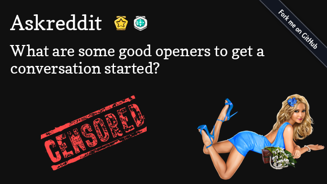

# Auddit

Tired of those Reddit text-to-speech videos on Youtube? Now you can make your own, automatically!

Official Auddit Youtube Channel: https://www.youtube.com/channel/UCMi63vc1Timv8dfrmcrrdFQ

## Dependencies

- Python 3
- Everything in the requirements.txt file
- https://github.com/porjo/youtubeuploader

## Setup

`sudo pip install -r requirements.txt`

Then add the following environnement variables:

- REDDIT_CLIENT_ID
- REDDIT_CLIENT_SECRET

Read about how to [create a Reddit application](https://ssl.reddit.com/prefs/apps/) to get those.

You also need to register an application on the Google OAuthv2 API. [Here's](https://developers.google.com/youtube/v3/guides/uploading_a_video) a guide. You need to put the resulting `client_secrets.json` in the root of the project.

## Running

`python src/main.py`

## Testing

All tests:

`python -m unittest`

Single test:

`python -m unittest test/test_reddit.py`

## How it works

Using the [Python Reddit API Wrapper](https://github.com/praw-dev/praw), we can query for hot posts from any subreddit. 

Then we pipe the text to the text-to-speech task, that generates an audio file using either ttsmp3.com or the [Google TTS Python Wrapper](https://gtts.readthedocs.io/en/latest/index.html). We prefer ttsmp3.com for the quality of the voices and use gTTS as a fallback if we get rate-limited.

Then, we send the text and the audio to the video generation tasks, which uses [PyMovie](https://zulko.github.io/moviepy/) to make a video with background music, the text-to-speech clips and the text.

Then we generate a thumbnail with the goal of clickbaiting the viewers with [Pillow](https://pillow.readthedocs.io/en/stable/).

All that is left is to [upload to Youtube using the Google API](https://github.com/porjo/youtubeuploader).

## Why

because i can
